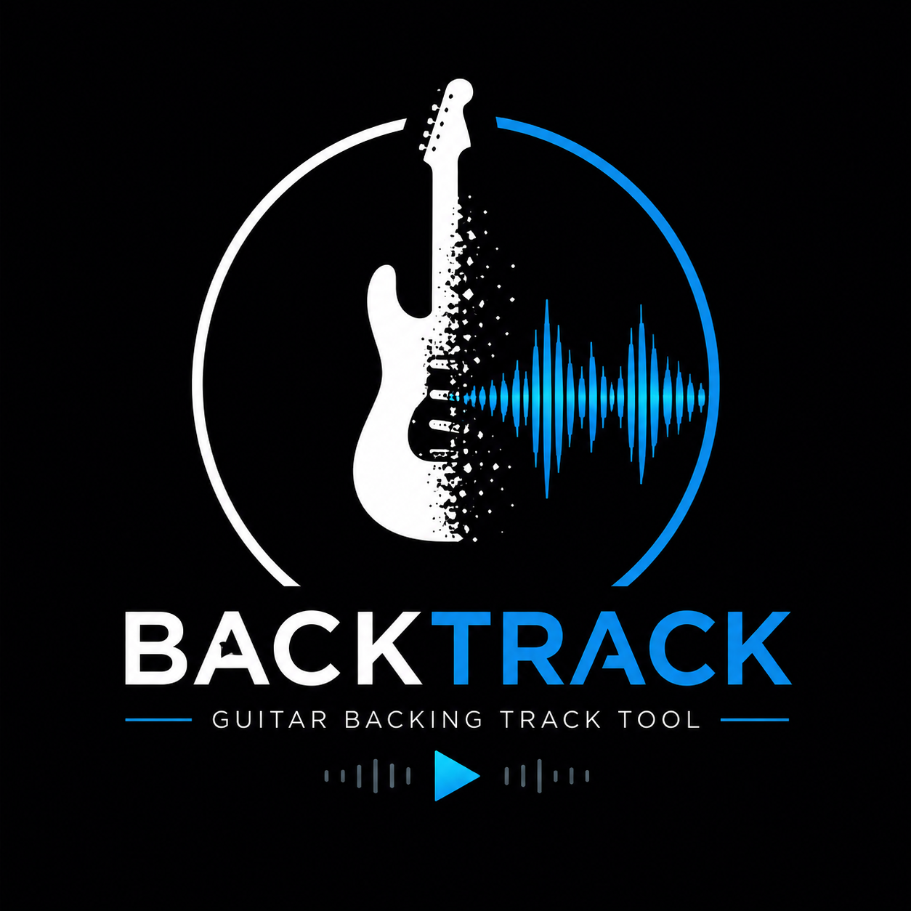

<p align="center">
  
</p>

<h1 align="center">BackTracker</h1>

<p align="center">
  A two-step Windows workflow for separating songs into stems and creating guitar-free backing tracks.
</p>

<p align="center">
  <a href="https://github.com/mpkottawa/BackTracker/releases/latest"><strong>Download the latest release</strong></a>
  ·
  <a href="#quick-start">Quick start</a>
  ·
  <a href="#troubleshooting">Troubleshooting</a>
</p>

## What BackTracker does

BackTracker coordinates [Ultimate Vocal Remover](https://ultimatevocalremover.com/) and
[Audacity](https://www.audacityteam.org/) to create practice-ready backing tracks from individual
songs or complete album folders.

The workflow has two desktop applications:

1. **UVR5 Album Separator** runs a six-stem UVR model and creates Bass, Drums, Guitar, Vocals,
   Piano, and Other files.
2. **Audacity Backing Tracks** mixes Bass + Drums + Vocals into an MP3 backing track, validates
   the result, and organizes the useful stems.

BackTracker preserves the source audio. Completed UVR albums and existing non-empty backing-track
files are detected and skipped, making interrupted jobs easier to resume.

> [!IMPORTANT]
> BackTracker automates the Windows interfaces of UVR5 and Audacity. Do not use the mouse or
> keyboard while UVR file dialogs are being filled.

## Features

- Processes one album or a parent folder containing multiple albums.
- Accepts MP3, WAV, FLAC, M4A, AAC, OGG, WMA, AIFF, and AIF source files.
- Produces six UVR stems per song using `htdemucs_6s`.
- Creates stereo MP3 backing tracks from Bass, Drums, and Vocals.
- Retains Guitar, Bass, Drums, and Vocals stems in an organized output tree.
- Optionally moves or copies retained stems.
- Validates every exported MP3 with FFmpeg.
- Skips complete separation folders and existing valid-size backing-track outputs.
- Supports custom application and workspace locations through environment variables.
- Includes a multi-resolution Windows application icon.

## Prerequisites

### 1. Windows

Windows 10 or Windows 11 is required. The current automation relies on Windows file dialogs,
PowerShell, process control, and Audacity named pipes.

### 2. Ultimate Vocal Remover (UVR5)

Install UVR5 from <https://ultimatevocalremover.com/>. Open it manually once and configure:

- **Process method:** Demucs
- **Model:** `htdemucs_6s`
- **Stem selection:** All Stems
- **Output format:** MP3
- **Acceleration:** GPU, when supported by your system

The selected model must produce exactly these six stems:

```text
Bass · Drums · Guitar · Vocals · Piano · Other
```

BackTracker expects UVR's bundled `ffmpeg.exe` to be in the same installation folder as
`UVR.exe`.

### 3. Audacity

Install Audacity from <https://www.audacityteam.org/>. Then enable its scripting module:

1. Open Audacity.
2. Open **Edit → Preferences → Modules**.
3. Set **mod-script-pipe** to **Enabled**.
4. Close and reopen Audacity once.

BackTracker temporarily enables the preference while processing and restores its previous value
afterward, but the module must be present in the Audacity installation.

## Installation

1. Open the [latest BackTracker release](https://github.com/mpkottawa/BackTracker/releases/latest).
2. Download both files:

   - `UVR5.Album.Separator.exe`
   - `Audacity.Backing.Tracks.exe`

3. Put them together in a folder such as `C:\Tools\BackTracker`.
4. If Windows SmartScreen appears, inspect the publisher and file source before choosing to run
   the app. Release executables are currently unsigned.

Python is not required for the release executables. The PowerShell helper used to control UVR is
bundled inside the separator.

## Quick start

### Recommended input layout

Place audio in one folder per album. Artist folders are optional.

```text
Music to process/
├── Artist One/
│   ├── Album A/
│   │   ├── 01 Song One.flac
│   │   └── 02 Song Two.flac
│   └── Album B/
│       └── 01 Another Song.mp3
└── Artist Two/
    └── Album C/
        └── Track 01.wav
```

Only audio files directly inside an album folder are grouped as that album.

### Step 1 — separate the songs

1. Close UVR if it is running.
2. Start `UVR5.Album.Separator.exe`.
3. For **Source folder**, choose one album or the parent folder containing several albums.
4. For **Processing output**, choose a separate processing folder.
5. Click **Start Separation**.
6. Leave the computer controls alone while UVR dialogs are automated.
7. Wait for the completion message and for the BackTracker window to return.

For each song, the processing folder will contain files similar to:

```text
01_Song One_(Bass).mp3
01_Song One_(Drums).mp3
01_Song One_(Guitar).mp3
01_Song One_(Vocals).mp3
01_Song One_(Piano).mp3
01_Song One_(Other).mp3
```

An album is skipped on a later run when it already contains six non-empty MP3 stems per source
track and no temporary WAV files.

### Step 2 — create the backing tracks

1. Close Audacity if it is running. BackTracker will also close any remaining Audacity process.
2. Start `Audacity.Backing.Tracks.exe`.
3. Select the processing folder created in Step 1.
4. Select a different finished-output folder.
5. Choose how stems should be handled:

   - **Checked (recommended):** move Bass, Drums, Guitar, and Vocals into the finished output;
     delete temporary Piano and Other stems after validation.
   - **Unchecked:** copy the retained stems and leave all processing files in place.

6. Click **Start** and wait for the completion message.

For every track, BackTracker imports Bass, Drums, and Vocals into Audacity, mixes them to stereo,
exports an MP3, and validates it with FFmpeg.

## Finished output

The relative album hierarchy from the processing folder is preserved. A finished album resembles:

```text
Finished/
└── Artist One/
    └── Album A/
        ├── Song One - Backing Track.mp3
        ├── Song Two - Backing Track.mp3
        └── stems/
            ├── bass/
            │   ├── Song One_(Bass).mp3
            │   └── Song Two_(Bass).mp3
            ├── drums/
            ├── guitar tracks/
            └── vocals/
```

> [!CAUTION]
> Keep source, processing, and finished folders separate. With the move option enabled,
> BackTracker moves retained stems and deletes Piano/Other files from the processing folder after
> successful backing-track validation.

## Default folders and configuration

The apps default to `%USERPROFILE%\BackTracker`:

```text
BackTracker/
├── source albums/
├── processing/
└── finished/
```

Every working folder can be changed in the graphical interface. The following environment
variables override application defaults:

| Variable | Purpose | Default |
| --- | --- | --- |
| `BACKTRACKER_ROOT` | Default BackTracker data folder | `%USERPROFILE%\BackTracker` |
| `UVR_EXE` | Full path to `UVR.exe` | `%LOCALAPPDATA%\Programs\Ultimate Vocal Remover\UVR.exe` |
| `AUDACITY_EXE` | Full path to `Audacity.exe` | `C:\Program Files\Audacity\Audacity.exe` |

Example PowerShell launch with custom locations:

```powershell
$env:BACKTRACKER_ROOT = 'D:\Music\BackTracker'
$env:UVR_EXE = 'D:\Apps\Ultimate Vocal Remover\UVR.exe'
$env:AUDACITY_EXE = 'D:\Apps\Audacity\Audacity.exe'

& 'C:\Tools\BackTracker\UVR5.Album.Separator.exe'
```

Environment variables set this way apply to programs started from the same PowerShell session.

## Troubleshooting

### UVR executable not found

Set `UVR_EXE` to the complete path of `UVR.exe`, then launch BackTracker from the same PowerShell
window. Confirm that `ffmpeg.exe` is beside `UVR.exe`.

### UVR clicks the wrong control or a dialog does not open

- Restore UVR to its normal window layout.
- Use 100% Windows display scaling when possible.
- Confirm UVR is already configured for Demucs `htdemucs_6s`, All Stems, and MP3.
- Close UVR and retry without using the mouse or keyboard.

The current UVR workflow uses control positions relative to the UVR window, so major UVR interface
changes may require an update to BackTracker.

### Separation stops early or times out

- Confirm the GPU/model works by separating one song directly in UVR.
- Check that the destination has enough free disk space.
- Remove incomplete output for the affected album before retrying.
- Large albums can take a long time; the helper's default timeout is 90 minutes per album.

### Audacity executable not found

Set `AUDACITY_EXE` to the complete path of `Audacity.exe` and relaunch from the same PowerShell
window.

### Audacity scripting-pipe error

- Confirm **mod-script-pipe** exists and is enabled under **Preferences → Modules**.
- Restart Audacity once after changing the module setting.
- Close all Audacity windows before starting Step 2.
- Check that `%APPDATA%\audacity\audacity.cfg` exists and contains a `mod-script-pipe` setting.

### Mismatched stem sets

The backing-track app requires matching Bass, Drums, Guitar, and Vocals filenames for every song.
Rerun Step 1 or remove incomplete stems. Piano and Other are not required for mixing, but they are
expected from the six-stem separation stage.

### MP3 validation failed

BackTracker uses the `ffmpeg.exe` included with UVR. Confirm it exists, retry the affected song,
and verify that the output folder is writable and has free space.

## Building from source

Requirements for source builds:

- Python 3.10 or newer
- PyInstaller
- Windows

```powershell
git clone https://github.com/mpkottawa/BackTracker.git
cd BackTracker
python -m pip install --upgrade pyinstaller
pyinstaller --clean --noconfirm 'UVR5 Album Separator.spec'
pyinstaller --clean --noconfirm 'Audacity Backing Tracks.spec'
```

Builds are written to `dist\`. Both specification files embed `backtrack.ico`; the separator spec
also embeds `run_uvr_album.ps1`.

Generated executables, `build\`, `dist\`, Python caches, logs, and state files are excluded from
Git because generated metadata can contain machine-specific paths.

## Project files

| File | Purpose |
| --- | --- |
| `uvr5_gui.pyw` | Graphical album discovery and six-stem separation queue |
| `run_uvr_album.ps1` | Windows automation used to control UVR |
| `audacity_backing_gui.pyw` | Graphical backing-track mixer and stem organizer |
| `backing_tracks_app.py` | Shared Audacity pipe, configuration, validation, and workflow helpers |
| `*.spec` | Reproducible PyInstaller build definitions |
| `backtrack-logo.png` | README/project logo |
| `backtrack.ico` | Multi-resolution Windows application icon |

## Privacy and safety

- Public source and release binaries are scanned for user-profile and machine-specific paths.
- Generated PyInstaller metadata is not committed.
- BackTracker does not upload audio or usage data. Audio processing is performed by the locally
  installed UVR and Audacity applications.
- Always keep backups of source audio. Review the move/delete behavior before processing valuable
  files.

## Limitations

- Windows only.
- Depends on the current UVR5 desktop layout and a specific six-stem model configuration.
- Produces MP3 stems and MP3 backing tracks in the current workflow.
- Release binaries are not code-signed.
- UVR and Audacity are separate third-party applications and are not bundled with BackTracker.

## License

BackTracker is available under the [MIT License](LICENSE).

Ultimate Vocal Remover and Audacity are independent third-party projects. Their names and marks
belong to their respective owners.
